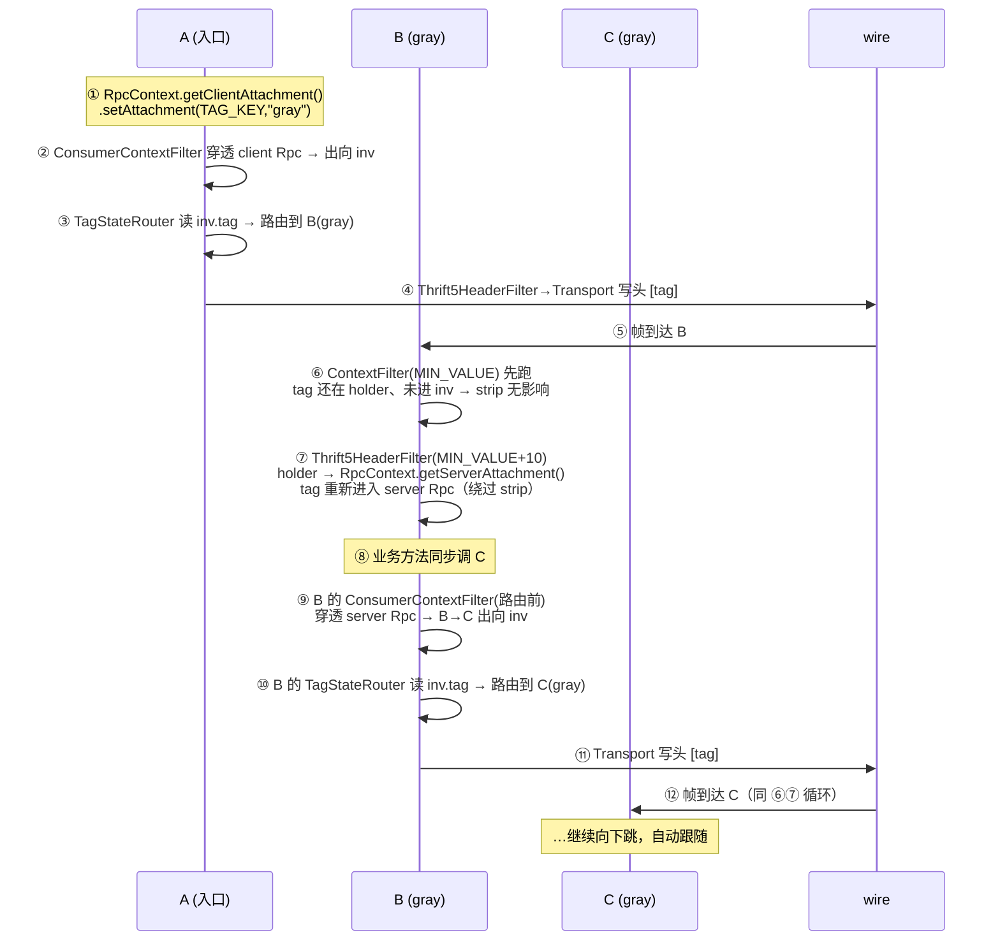

# Thrift5 协议头（Dubbo Attachment 透传）实现方案

> 范围：仅 dubbo↔dubbo 互通；wire 格式可自由扩展。
> 目标：让依赖"协议头"的 Dubbo 治理能力（隐式参数 attachment、链路追踪、Token 鉴权、灰度/压测标、结果 attachment 回带）在 thrift5 协议下可用。

---

## 1. 为什么现在用不了

当前调用链（消费者侧）：

```
AbstractInvoker#doInvoke
  → proxyFactory.getInvoker(doRefer(...)) 生成的 Invoker
  → 反射调用 ThriftPoolDirectProxy$X（字节码生成的代理）
  → ((Iface) thriftClient).method(args)      // 原生 TBinaryProtocol + TFramedTransport
```

- `ThriftPoolDirectProxy` 生成的代码只做 `borrowClient / before / 调用 / success|error / over / recycleClient`，**不读 `RpcContext` 附件，也不写协议头**。
- `ThriftInterceptor` 的 `before/success/error` 仅打日志。
- 原生 thrift wire（`TBinaryProtocol` + `TFramedTransport`）**没有承载 Dubbo attachment 的位置**。

结果：消费者 `RpcContext.setAttachment(k,v)` 设的值到不了提供者；提供者侧 Dubbo Filter 链虽能经 `proxyFactory.getProxy(invoker, true)` 跑起来，但拿不到任何附件。

---

## 2. 总体思路（路线 A：在 thrift frame 外套 Dubbo 协议头）

核心：在 thrift 的 frame body 里，**thrift 消息字节前面再加一段 Dubbo 头**。消费端写入、提供端读出，两端各做一个 Transport 装饰器 + 一个 Dubbo Filter 做桥接。

### 2.1 目标 wire 格式

thrift 的 `TFramedTransport` 现有格式（仅 dubbo↔dubbo，故可改）：

```
原 wire:   [4 字节 frame 长度 N][N 字节 thrift 消息]
新 wire:   [4 字节 frame 长度 N][N 字节 = (Dubbo 头) | (thrift 消息)]
                                    └── header ──┘ └── body ──┘
```

`frame 长度` 仍是 thrift `TFramedTransport` / `TNonblockingServer` 自己管的 4 字节，**完全不动**。我们只在 frame **body** 的最前面塞一段 Dubbo 头。这样：

- thrift 端读 frame 时拿到的是 `[Dubbo 头 | thrift 消息]`。
- 提供端用自定义 `inputTransportFactory` 把头"消费掉"，再把剩余字节交给 `TBinaryProtocol` 正常解析。
- 消费端用自定义 Transport 在 `flush` 时把头缓冲到 thrift 消息前面。

### 2.2 Dubbo 头格式（定长前缀 + 变长附件块）

```
偏移   长度   字段              说明
0      2      magic             0xD0 0xBB（"dubbo" 识别符，和原生 thrift 区分）
2      1      version/flags     低 4 位 = 附件序列化 id（2=hessian2）；高 4 位保留
3      2      headerLen         附件块字节数（大端，不含前面 5 字节）
5      headerLen  attachmentBlock   附件序列化字节
5+HL   ...    <thrift 消息字节，由 TBinaryProtocol 正常解析>
```

附件块序列化（`serialization id = 2`，hessian2，与原生 dubbo 协议附件编解码路径一致）：

```
hessian2 writeObject(Map<String,Object>) 整体序列化
读侧 readObject(Map.class) 反序列化
```

> 与原生对齐：`DubboCodec.encodeRequestData` 末尾 `out.writeAttachments(inv.getObjectAttachments())`，而
> `ObjectOutput.writeAttachments` 默认实现即 `writeObject(map)`；读侧 `ObjectInput.readAttachments()`
> 默认即 `readObject(Map.class)`。因此 `Integer`/`Long`/`Boolean`/`null`/嵌套 `Map` 均按原类型往返，
> 不做 String 扁平化——这正是用户在原生 dubbo 协议下得到的行为。
> `AttachmentCodec` 直接复用 `Hessian2ObjectOutput`/`Hessian2ObjectInput`（单参 OutputStream/InputStream 构造，无需 URL），
> compile 依赖 `dubbo-serialization-hessian2`（`dubbo-rpc-triple`/`dubbo-rpc-dubbo`/`dubbo-rpc-injvm`/`dubbo-cluster` 均如此）。

> 为什么自带 magic/序列化 id：协议头是定长帧控区，固定走 hessian2 是合适的（类比原生 dubbo 的 16 字节定长头也是固定格式、不随 body 序列化变化）。`version/flags` 低 4 位留作 id，将来需要换 protobuf/自定义类型分发布时按 id 分发，wire 不破坏。

### 2.3 响应方向

响应 wire 对称：

```
[4 字节 frame 长度 N][N 字节 = (Dubbo 响应头) | (thrift 响应消息)]
```

响应头复用同格式，附件块即 provider 侧 `RpcContext.getServerContext()` 里要回带的 result attachment。消费端 Transport 读响应时先剥头，把回带附件塞回 `RpcContext`。

---

## 3. 落地改造点

### 3.1 新增组件

| 类 | 位置 | 职责 |
|---|---|---|
| `DubboHeader` | `thrift5/codec` | 头的编解码（读写 magic/version/headerLen/attachmentBlock）。 |
| `AttachmentCodec` | `thrift5/codec` | `Map<String,Object>` ↔ 字节的 hessian2 序列化（复用原生 `writeObject(map)` / `readObject(Map.class)`）。 |
| `Thrift5AttachmentHolder` | `thrift5/support` | `ThreadLocal<Map<String,Object>>`，Transport 与 Filter 间传递附件。 |
| `DubboHeaderClientTransport` | `thrift5/transport` | 装饰消费端 `TTransport`：写时缓冲 thrift 字节，`flush` 前从 `Thrift5AttachmentHolder` 取附件写 Dubbo 头；读响应时先剥头、回带附件塞回 `RpcContext`。 |
| `DubboHeaderServerInputTransport` | `thrift5/transport` | 装饰提供端 `TMemoryInputTransport`：eager 消费 Dubbo 头、附件入 `Thrift5AttachmentHolder`，后续字节透传给 `TBinaryProtocol`。 |
| `DubboHeaderInputProtocolFactory` | `thrift5/transport` | `TProtocolFactory`，提供端 `inputProtocolFactory`：eager 读头 + 包 `DubboHeaderServerInputTransport`。 |
| `DubboHeaderOutputProtocolFactory` | `thrift5/transport` | `TProtocolFactory`，提供端 `outputProtocolFactory`：返回 `TBinaryProtocol` 子类，`writeMessageBegin` 先写响应头（阶段一空头）。 |
| `Thrift5HeaderFilter` | `thrift5/filter` | Dubbo `Filter`（SPI，`group=provider/consumer` 双侧）：consumer 侧（order 偏大、最内层）捕获 `invocation.attachments ∪ RpcContext` → holder；provider 侧（order=MIN_VALUE+10）holder → 注回 `invocation` + `RpcContext.getServerAttachment()`。 |

### 3.2 消费端改造（`Thrift5Protocol#processRefer` / `ThriftPoolDirectProxy`）

同步客户端当前：

```java
TSocket tSocket = new TSocket(host, port);
TTransport transport = new TFramedTransport(tSocket);
TProtocol tp = new TBinaryProtocol(transport);
T client = new Xxx.Client(tp);
```

改为：

```java
TSocket tSocket = new TSocket(host, port);
TTransport framed = new TFramedTransport(tSocket);
DubboHeaderClientTransport header = new DubboHeaderClientTransport(framed);
TProtocol tp = new TBinaryProtocol(header);
T client = new Xxx.Client(tp);
```

- 写路径：`TBinaryProtocol` 写 thrift 消息 → `header` 缓冲；`header.flush()` 先从 `Thrift5AttachmentHolder` 取附件（holder 由 consumer `Thrift5HeaderFilter` 灌入）写成 Dubbo 头，再写缓冲的 thrift 字节，再 `framed.flush()`（`framed` 自动补 4 字节长度）→ wire = `[len][头|thrift]`。✅
- 读路径：`header.read()` 先读并消费响应 Dubbo 头，回带附件塞回 `RpcContext`；剩余字节透传给 `TBinaryProtocol` 读响应消息。✅

异步客户端（`$AsyncClient` + `TNonblockingSocket`）后续单独处理（见 §6）。

### 3.3 提供端改造（`Thrift5Protocol#processExport` / `getDefaultArgs`）

> **源码实证修正（libthrift 0.6.1）**：`TNonblockingServer.FrameBuffer.getInputTransport()` 直接 `new TMemoryInputTransport(buffer_.array())`，**`inputTransportFactory_` 没有被用上**。因此请求方向的输入 hook **不是** transport factory，而是 **`inputProtocolFactory_`**（`Args.inputProtocolFactory(TProtocolFactory)` 可设）。响应方向同理用 **`outputProtocolFactory_`**（在 `writeMessageBegin` 前写头，无需缓冲）；`outputTransportFactory_` 虽也被 `getOutputTransport()` 调用，但用 protocol factory 更简单，故输出侧也走 protocol factory。

`THsHaServer.Args`：

```java
THsHaServer.Args args = new THsHaServer.Args(serverTransport)
        .processor(processor)
        // 请求方向：用 protocol factory 包一层，在读 thrift 消息前先消费 Dubbo 头
        .inputProtocolFactory(new DubboHeaderInputProtocolFactory(new TBinaryProtocol.Factory()))
        // 响应方向：用 protocol factory 包一层，在 writeMessageBegin 前先写 Dubbo 头
        // 阶段一写空头（headerLen=0），阶段二填 RpcContext.getServerResponseContext() 附件
        .outputProtocolFactory(new DubboHeaderOutputProtocolFactory(new TBinaryProtocol.Factory()))
        .executorService(executorService);
```

- `DubboHeaderInputProtocolFactory.getProtocol(inTrans)`：`inTrans` 是 `TMemoryInputTransport`（含完整 frame body = `[Dubbo 头 | thrift 消息]`）。**eager 读 Dubbo 头**（5 字节定长 + headerLen 字节附件）、附件入 `Thrift5AttachmentHolder`，再返回 `TBinaryProtocol(new DubboHeaderServerInputTransport(inTrans))`（剩余字节透传给 TBinaryProtocol）。eager 读发生在工作线程（`FrameBuffer.invoke()` 内），与后续 Filter 链同线程。
- `DubboHeaderOutputProtocolFactory.getProtocol(outTrans)`：返回 `TBinaryProtocol` 子类，重写 `writeMessageBegin`：先写 Dubbo 头（阶段一 `headerLen=0`；阶段二读 `RpcContext.getServerResponseContext()`），再 `super.writeMessageBegin()`。此时业务方法已返回、附件已就绪，**无需缓冲、无需 flush 信号**——头字节直接流到 `response_`。
- `TProcessor.process` → 读消息 → 调 `impl.method`（`impl` 是 `proxyFactory.getProxy(invoker, true)` 生成的 Dubbo 代理）→ 进入 Dubbo provider Filter 链。此时 holder 已有附件。

### 3.4 与 Dubbo Filter 链桥接（`Thrift5HeaderFilter`）

> **目标**：和原生 Dubbo 的协议头治理能力**对齐**，不超出。
>
> **源码实证（Dubbo 3.3）关键点**：
> - Dubbo tracing（`dubbo-tracing`）的 carrier 是 **`Invocation`**：`DubboClientContext extends SenderContext<Invocation>`，`setCarrier(invocation)`。consumer 侧 `ObservationSenderFilter`（`@Activate(group=CONSUMER, order=Integer.MIN_VALUE+50)`）把 traceId 注入 **`invocation.getAttachments()`**；provider 侧 `ObservationReceiverFilter`（同 order）从 **`invocation.getAttachments()`** 抽取。
> - `ContextFilter` 是 `@Activate(group=PROVIDER, order=Integer.MIN_VALUE)`，provider 最早。
> - consumer 侧 `AbstractInvoker.addInvocationAttachments` 会在叶子节点把 `RpcContext.getClientAttachment()` merge 进 invocation——但那是发生在 `AbstractInvoker.invoke` 内部、所有 filter 之后。tracing 注入在 `ObservationSenderFilter`（更外层），早于该 merge。
>
> 结论：附件要跨网带 tracing/token 这类注入值，**两端都必须经 Invocation**，且 provider filter 必须在 tracing receiver 之前。故 consumer/provider 都用 filter + holder（废弃"transport 直接读 RpcContext"的简化）。

**consumer 侧 `Thrift5HeaderFilter`**（`@Activate(group=CONSUMER, order=Integer.MAX_VALUE-1000)`——最内层，在 `ObservationSenderFilter`(MIN_VALUE+50) 之后，捕获所有外层 filter 注入）：

```java
Result invoke(Invoker<?> invoker, Invocation inv) throws RpcException {
    Map<String,Object> hdr = new LinkedHashMap<>();
    if (inv.getObjectAttachments() != null) hdr.putAll(inv.getObjectAttachments());         // tracing/token 注入的在这
    hdr.putAll(RpcContext.getClientAttachment().getObjectAttachments());                   // 用户直接 set 的在这
    Thrift5AttachmentHolder.set(hdr);
    try {
        return invoker.invoke(inv);   // → AbstractInvoker.doInvoke → thrift proxy → DubboHeaderClientTransport.flush() 读 holder
    } finally {
        Thrift5AttachmentHolder.clear();
    }
}
```
`DubboHeaderClientTransport.flush()` 读 **`Thrift5AttachmentHolder`**（不再直接读 RpcContext）。

**provider 侧 `Thrift5HeaderFilter`**（`@Activate(group=PROVIDER, order=Integer.MIN_VALUE+10)`——夹在 `ContextFilter`(MIN_VALUE) 与 `ObservationReceiverFilter`(MIN_VALUE+50) 之间）：

```java
Result invoke(Invoker<?> invoker, Invocation inv) throws RpcException {
    Map<String,Object> hdr = Thrift5AttachmentHolder.get();
    if (hdr != null && !hdr.isEmpty()) {
        // 1) 注回 invocation：让后续的 ObservationReceiverFilter / TokenFilter 等能从 invocation 读到
        inv.addObjectAttachments(hdr);
        // 2) 同时直接塞 RpcContext.getServerAttachment()：业务方法从 RpcContext 读（ContextFilter 已先跑过、不会再 sync）
        RpcContext.getServerAttachment().addObjectAttachments(new LinkedHashMap<>(hdr));
    }
    try {
        return invoker.invoke(inv);
    } finally {
        Thrift5AttachmentHolder.clear();   // 线程复用，必须清
    }
}
```

provider Filter 链顺序：`ContextFilter`(MIN_VALUE) → **`Thrift5HeaderFilter`(MIN_VALUE+10)** → `ObservationReceiverFilter`(MIN_VALUE+50，从 invocation 抽 traceId ✅) → … → 业务（从 RpcContext 读 ✅）。

注册 SPI：`META-INF/dubbo/org.apache.dubbo.rpc.Filter`（thrift5 模块内）：
```
thrift5header=org.apache.dubbo.rpc.protocol.natives.thrift5.filter.Thrift5HeaderFilter
```
consumer/provider 两侧均激活。

> 备注：`Thrift5HeaderFilter` 取代当前 `ThriftInterceptor` 里 `before/success/error` 打日志的职责——附件桥接做在 Dubbo Filter 层，不在字节码生成的代理里硬编码。

> **对齐说明**：跨线程池（B 业务自管线程池调 C）的 traceId 传递，原生 Dubbo 也不支持（`RpcContext` 是 ThreadLocal，无自动跨池传播器）。本方案**不超前做**，列为最后阶段（见 §6 阶段三）。

### 3.5 `ThriftInterceptor` / `ThriftPoolDirectProxy` 的调整

- `ThriftPoolDirectProxy` 模板里 `thriftInterceptor.before(...)` 这些埋点保留或精简，但**不再承担附件逻辑**（附件由 Transport + Filter 负责）。
- `ThriftInterceptor.recycleClient` 的连接失效判定逻辑保留。

---

## 4. 附件流转闭环

```
消费者业务代码
  RpcContext.getContext().setAttachment("traceId", "x")
        │ (consumer ContextFilter 复制到 invocation)
        ▼
Thrift5HeaderFilter(consumer)  ── holder.set(attachments)
        │
        ▼  (同线程)
ThriftPoolDirectProxy$X  →  thriftClient.method(args)
        │
DubboHeaderClientTransport.flush()
  写 [magic|ver|hl|attachments] + 缓冲的 thrift 字节
  → TFramedTransport 补 4 字节长度 → wire
        │  ── 网络 ──▶
        ▼
提供端 TNonblockingServer.FrameBuffer 读帧
  → DubboHeaderServerTransport 消费 Dubbo 头
  → holder.set(attachments)
        │
TProcessor → impl.method(args)  (impl 是 Dubbo 代理)
        ▼
Thrift5HeaderFilter(provider)  inv.addAttachments(holder)
  → ContextFilter / TokenFilter / Tracing 正常工作
  → 业务实现
  → RpcContext.getServerContext() setAttachment("result", ...)   // 回带
        ▼
响应写回 → DubboHeaderOutputProtocolFactory.writeMessageBegin 补响应头 → wire
        │  ── 网络 ──▶
        ▼
消费端 DubboHeaderClientTransport.read() 剥响应头
  → 回带附件塞回 RpcContext
```

---

## 5. 风险与约束

1. **线程模型（已实证，结论：普通 `ThreadLocal` 可用）**：libthrift 0.6.1 的 `THsHaServer` 中，`SelectThread` 只负责读帧 body 进 `buffer_`；`requestInvoke` 被重写为提交 `Invocation` 到 `invoker` 线程池；`Invocation.run()`（工作线程）调 `frameBuffer.invoke()`，其中 `inputProtocolFactory_.getProtocol(inTrans)` 读 Dubbo 头（set holder）、`processor.process` 读 thrift 消息并调 Dubbo 代理进 Filter 链。**头解析 + holder.set + Filter 链 + 业务方法全在同一工作线程**，普通 `ThreadLocal` 即可，无需 `InheritableThreadLocal` 或跨线程传递。
2. **holder 清理**：工作线程复用，每个请求结束后 `Thrift5HeaderFilter#finally` 必 `clear`，否则脏附件泄漏到下一请求。
3. **`TMemoryInputTransport` 字节边界**：提供端 frame body 是内存 buffer，`DubboHeaderServerTransport` 读头时要按 `headerLen` 精确消费，剩余字节原样透传给 `TBinaryProtocol`，不能多读/少读。
4. **附件大小**：`headerLen` 是 2 字节 → 附件块最大 ~64KB。超出需改 4 字节或前置告警。治理附件通常很小，先 2 字节够用。
5. **异步客户端**：`$AsyncClient` 走 `TNonblockingSocket` + `TAsyncClientManager`，写读路径和同步不同，`DubboHeaderClientTransport` 的 flush/读时机要单独适配，列为第二阶段。
6. **连接池**：`ThriftGenericKeyedObjectPool` 复用 client，Transport 装饰器随 client 一起池化；holder 是 per-call 的 ThreadLocal，不随 client 走，无状态冲突。
7. **与原生 thrift 不互通**：本方案 wire 加了 Dubbo 头，原生 libthrift 服务端读帧后会把头当 thrift 消息解析 → 报错。这是"仅 dubbo↔dubbo"的预期代价，文档/README 要写明。
8. **magic 校验失败的处理**：消费端/提供端若读到非 `0xD0BB`，说明对端是原生 thrift，应抛清晰异常（"对端非 dubbo thrift5，不支持互通"），而不是当 bug 排查。
9. **响应方向（已简化）**：响应侧用 `outputProtocolFactory_`（重写 `writeMessageBegin` 先写头），阶段一写 `headerLen=0` 空头即可与消费端对称、且阶段二直接填 `RpcContext.getServerResponseContext()` 附件平滑升级。**无需缓冲、无需 flush 信号**。原 §3.3 用 `outputTransportFactory` + 缓冲的方案已废弃。
10. **生成代码 flush（联调确认）**：消费端 `$Client.send_X` 末尾调 `oprot_.getTransport().flush()`、提供端 `Processor.process` 末尾调 flush——TFramedTransport 契约要求，应存在。联调时对着实际生成的 `$Client`/`$Processor` 确认一次；缺失则消费端写头缺触发点。

---

## 5.1 协议头治理能力对齐情况（已实证 provider filter order）

provider 侧 `Thrift5HeaderFilter`(`order=MIN_VALUE+10`) 与各治理 filter 的相对位置（Dubbo filter：order 小=外层=先执行）：

| provider filter | order | 与我们的关系 | 结论 |
|---|---|---|---|
| `ContextFilter` | `MIN_VALUE` | 在我们之前（更外层） | 先建好 RpcContext，我们再注入 ✅ |
| `Thrift5HeaderFilter`（我们） | `MIN_VALUE+10` | — | holder → 注回 `invocation` + `RpcContext.getServerAttachment()` |
| `ObservationReceiverFilter`（tracing） | `MIN_VALUE+50` | 在我们之后 | 从 `invocation` 抽 traceId ✅ |
| `TokenFilter` | `0`（默认） | 在我们之后 | `inv.getObjectAttachmentWithoutConvert(TOKEN_KEY)` ✅ |
| `EchoFilter` | `-110000` | 在我们之后 | ✅ |
| `ExceptionFilter` | `0`（默认） | 在我们之后 | ✅ |

**对齐清单（协议头相关治理）：**

| 能力 | 能否对齐 | 阶段 |
|---|---|---|
| 隐式参数 attachment 透传 | ✅ | 阶段一 |
| traceId 链路追踪（单跳） | ✅（tracing carrier=Invocation，filter 顺序已对齐） | 阶段一 step 9 联调 |
| Token 鉴权 | ✅ | 阶段一 |
| 超时透传（TIMEOUT_ATTACHMENT） | ✅ | 阶段一 |
| 灰度/压测标 | ✅ | 阶段一 |
| 标签路由（consumer 内决策） | ✅（`TagStateRouter` 读 invocation tag / URL `dubbo.tag`） | 阶段一 |
| 标签跨跳跟随（全链路灰度 A→B→C） | ✅（搭原生 `ConsumerContextFilter` 穿透 + 我们注回 server RpcContext，详见 §5.3） | 阶段一（同线程嵌套） |
| result attachment 回带 | ✅ | 阶段二 |

## 5.2 协议头范围之外的能力（与原生对照）

下列能力不是协议头问题，与"协议头治理对齐"目标无关，单列对照：

| 能力 | 原生 Dubbo | thrift5 | 处置 |
|---|---|---|---|
| 泛化调用（`generic=true` / `$invoke`） | ✅ | 不适用 | thrift5 消费者天然有 IDL 生成的 `$Iface`（强类型），泛化"无接口 jar 也能调"的价值在 thrift5 生态不存在，**主动不做** |
| 异步调用 | ✅ | thrift5 不用单独做 | 消费端异步由 thrift `$AsyncClient` 提供（已实现 `SupportAsyncClient`/`AsyncIface` 代理）；提供端异步（`startAsync`/`CompletableFuture` 返回）不接——thrift `TProcessor` 同步模型，靠调大 `THsHaServer` 工作池即可，不值得为它改造。两端都不动 |
| 跨业务线程池 traceId/tag 传递 | ❌ | ❌ | 原生亦不支持 → 阶段三最后做 |

## 5.3 全链路灰度（tag 跨跳自动跟随 A→B→C）的实证结论

> **结论先说**：在 §3 设计落地后，全链路灰度（tag 自动跟随）**几乎零额外成本即可拿到**——它搭在原生 Dubbo 的 `ConsumerContextFilter`（穿透）+ `TagStateRouter`（路由）上，thrift5 只需 §3.4 已有的 provider filter 把 tag 注回 `RpcContext.getServerAttachment()`。**无需自定义 Router，不超出原生能力。**

### 5.3.1 原生 Dubbo 的 tag 穿透机制（源码实证，Dubbo 3.3）

- **`ConsumerContextFilter`**（`@Activate(group=CONSUMER, order=Integer.MIN_VALUE)`，`ClusterFilter`——**集群级 filter，在路由之前跑**）：
  - 第 73-84 行：若没有注册任何 `PenetrateAttachmentSelector` 扩展（生产环境默认无，只有 test 的 mock），则把 **`RpcContext.getServerAttachment()` 的全部附件** `addObjectAttachments` 到**出向 invocation**。
  - 第 85-95 行：把 `RpcContext.getClientAttachment()` 的附件也合并进 invocation。
  - 因为它是 `ClusterFilter`、包裹在 cluster invoker 外层，故**在 `AbstractClusterInvoker.invoke`→`directory.list`（路由）之前**执行 → 出向 invocation 在路由时已带 tag。
- **`TagStateRouter`**（consumer 路由）：`String tag = StringUtils.isEmpty(invocation.getAttachment(TAG_KEY)) ? url.getParameter(TAG_KEY) : invocation.getAttachment(TAG_KEY);`（第 109-111 行）。读 invocation 上的 tag 选 provider。**只要 ConsumerContextFilter 把 tag 放上了 invocation，路由就能用。**
- **`ContextFilter`**（provider，`order=MIN_VALUE`）：第 88 行 `keySet.add(TAG_KEY)`（TAG_KEY ∈ `UNLOADING_KEYS`）。第 137-158 行逻辑：把 `invocation.getObjectAttachments()` 过滤掉 `UNLOADING_KEYS`（含 TAG_KEY）后，再 `putAll` 进 `RpcContext.getServerAttachment()`。**即 tag 不会被 ContextFilter 放进 server RpcContext**（只在 invocation 上保留）。这正是纯原生 Dubbo 全链路灰度"不靠附件自动跟随、而靠每跳 `dubbo.tag` 配置 / tag-router 规则"的根因。

### 5.3.2 thrift5 为什么能白拿

在 §3.4 设计下，B 节点（provider，接收 A→B）的处理顺序：

1. `ContextFilter`（`MIN_VALUE`）先跑：此时 invocation 上**没有 tag**（tag 还在我们的 holder 里、没注进 invocation），server RpcContext 也无 tag。
2. **`Thrift5HeaderFilter`（provider，`MIN_VALUE+10`）**后跑：从 `Thrift5AttachmentHolder`（wire 侧）读出 tag，`inv.addObjectAttachments(hdr)` + `RpcContext.getServerAttachment().addObjectAttachments(hdr)`。**tag 被直接放进 server RpcContext，绕过了 ContextFilter 的 strip。**
3. B 的业务方法执行；当 B 同步调用 C 时，**B 的 `ConsumerContextFilter`（cluster，`MIN_VALUE`，路由前）**把 `RpcContext.getServerAttachment()`（含我们注入的 tag）穿透到 B→C 的出向 invocation。
4. B 的 `TagStateRouter` 读出向 invocation 上的 tag → 路由到 C 的 gray 实例。
5. B 的 consumer `Thrift5HeaderFilter` + `DubboHeaderClientTransport` 把 tag 写进 B→C 的 wire 头 → C 收到，回到步骤 1。

A→B→C→… 每跳都自动跟随，**链路上无需任何一跳额外配置 `dubbo.tag`**。

### 5.3.3 需要做什么 / 不需要做什么

| 项 | 是否需要 | 说明 |
|---|---|---|
| §3 附件透传（wire 头） | 需要 | 已在阶段一，tag 靠它过网 |
| provider `Thrift5HeaderFilter` 注回 `RpcContext.getServerAttachment()` | 需要 | 已在 §3.4（line 178），**不需要改** |
| consumer `Thrift5HeaderFilter` 捕获出向 tag 写头 | 需要 | 已在 §3.4，**不需要改** |
| 自定义 `Router` / 自定义 `ClusterFilter` | **不需要** | 不超出原生；tag 进 server RpcContext 后由原生 `ConsumerContextFilter` 自动穿透 |
| 注册 `PenetrateAttachmentSelector` | **不需要** | 默认无 selector = 全量穿透，已满足 |
| provider 侧打 `dubbo.tag` 标注 gray 实例 | 需要 | 这是治理侧动作（注册中心元数据），与协议无关；thrift5 provider 注册时带 `dubbo.tag=gray` 即可，和原生一致 |
| 入口 A 设初始 tag | 需要 | `RpcContext.getClientAttachment().setAttachment(TAG_KEY,"gray")` 或 ReferenceConfig 上 `dubbo.tag`；和原生一致 |

### 5.3.4 边界与前置条件

- **同线程嵌套调用**：B 的业务方法在 B 的 invoke 线程内同步调 C，server RpcContext 仍持有 tag，`ConsumerContextFilter` 才能读到。若 B 把调用丢到**自管线程池**（跨池），server RpcContext（ThreadLocal）丢失 → tag 断链。这与"跨业务线程池传递"是**同一个缺口**，原生也不支持，列阶段三（见 §6）。**全链路灰度的自动跟随只在"同线程嵌套"下成立。**
- **`ContextFilter` 的 strip 不影响我们**：我们注入 server RpcContext 发生在 ContextFilter 之后（order 更大），strip 已结束；且我们从 holder（wire）注入、不依赖 invocation 被 strip 与否。
- **不要给 thrift5 单独注册 `PenetrateAttachmentSelector`**：一旦注册了 selector 且 selector 没把 TAG_KEY 选进去，反而会把"默认全量穿透"破坏掉。保持默认。

---

## 6. 实施步骤建议（三阶段）

> 目标：和原生 Dubbo 协议头治理能力**对齐**。原生 Dubbo 不支持的（跨线程池 traceId 传递）本方案也不超前做，列最后。

**阶段一（打通附件透传：请求方向 + 空响应头对称）**
1. `DubboHeader` / `AttachmentCodec` 编解码 + 单测。
2. `Thrift5AttachmentHolder`（ThreadLocal）。
3. `DubboHeaderClientTransport`（写：flush 读 holder 写头；读：剥响应头回填 RpcContext）。
4. `DubboHeaderServerInputTransport` + `DubboHeaderInputProtocolFactory`（eager 读请求头 → holder）。
5. `DubboHeaderOutputProtocolFactory`（`writeMessageBegin` 先写空头）。
6. `Thrift5Protocol` 同步客户端与服务端接上自定义 Transport / ProtocolFactory。
7. `Thrift5HeaderFilter`（consumer order=MAX_VALUE-1000 + provider order=MIN_VALUE+10）+ SPI 注册（双侧激活）。
8. 联调单跳：消费者 `RpcContext.getClientAttachment().setAttachment("traceId","x")`，提供者业务方法里 `RpcContext.getServerAttachment().getAttachment("traceId")` 能拿到；响应方向能正常往返（空头对称）。
9. 联调 tracing：启用 `dubbo-tracing`（OTel/Brave），验证 traceId 经 `ObservationSenderFilter`→invocation→我们的头→provider `ObservationReceiverFilter` 全链路打通。

**阶段二（补齐，对齐原生其余协议头能力）**
10. 响应方向 result attachment 回带（`outputProtocolFactory` 写头时填 `RpcContext.getServerResponseContext()` 附件；消费端剥头回填）。
11. 异步客户端（`$AsyncClient`）适配。
12. `ThriftInterceptor` / `ThriftPoolDirectProxy` 模板清理，把日志埋点收敛到 Filter。
13. 异常路径（连接失效、magic 校验失败、附件超大）的收口。

**阶段三（原生不支持的，最后再考虑）**
14. 跨业务线程池的 traceId/tag 传递（`Thrift5ContextExecutor` 装饰器）。原生 Dubbo 亦不支持，仅当有明确诉求再做。

---

## 7. 已确认的决定

- [x] **Dubbo 头格式（§2.2）**：按 §2.2 落地。`headerLen` 用 2 字节（附件块上限 64KB），治理附件通常很小，够用；预留 `version/flags` 以便后续扩 4 字节不破坏存量。
- [x] **附件序列化**：用 hessian2（`serialization id = 2`），与原生 dubbo 协议附件编解码路径对齐。
  - 复用 `Hessian2ObjectOutput`/`Hessian2ObjectInput`，走 `writeAttachments → writeObject(map)` / `readAttachments → readObject(Map.class)`，与 `DubboCodec.encodeRequestData` 末尾 `out.writeAttachments(...)` 完全同路。
  - 理由：原生 dubbo 协议下 `Map<String,Object>` 是保类型的（`Integer`→`Integer`、`null`→`null`、嵌套 `Map`→`Map`）。早期曾考虑用"简单 KV + 值 stringify"避免 hessian 依赖，但这会让用户 `setObjectAttachment("retries", 3)` 在另一端拿到 `String "3"` 而 `(Integer)` ClassCastException——与原生行为不符。对齐原生更可靠，且 hessian2 是 Dubbo 默认序列化、运行时必在。
  - compile 依赖 `dubbo-serialization-hessian2`（`dubbo-rpc-triple`/`dubbo-rpc-dubbo`/`dubbo-rpc-injvm`/`dubbo-cluster` 均直接 compile 依赖此实现，有先例）。
  - 空 / null map 仍走 `DubboHeader.writeEmpty`（headerLen=0），省一次 hessian2 序列化；读侧 headerLen=0 返回空 map。
  - `version/flags` 低 4 位留作 `serialization id`，将来需要换 protobuf/类型分发布时按 id 分发，wire 不破坏。
- [x] **异步客户端**：阶段一**只做同步**，异步（`$AsyncClient` + NIO）放阶段二。当前主要矛盾是治理能力打通而非吞吐；异步 Transport 的 flush/读时机差异会拖慢阶段一。
- [x] **Filter 激活方式与顺序（对齐 tracing）**：`Thrift5HeaderFilter` 走 Dubbo SPI（`META-INF/dubbo/org.apache.dubbo.rpc.Filter`）自动激活，`group={PROVIDER, CONSUMER}` 双侧。
  - consumer：`order=Integer.MAX_VALUE-1000`（最内层，在 `ObservationSenderFilter`(MIN_VALUE+50) 之后），捕获 `invocation.attachments ∪ RpcContext.getClientAttachment()`。
  - provider：`order=Integer.MIN_VALUE+10`（夹在 `ContextFilter`(MIN_VALUE) 与 `ObservationReceiverFilter`(MIN_VALUE+50) 之间），holder 注回 `invocation` + `RpcContext.getServerAttachment()`。
  - 两处顺序都是为了和 Dubbo tracing（carrier=Invocation）对齐，单跳 traceId 能通。
- [x] **能力边界**：目标是和原生 Dubbo 协议头治理能力对齐。跨业务线程池的 traceId/tag 传递原生 Dubbo 也不支持，列阶段三最后做，不超前。

---

## 8. 架构流程图

### 8.1 单跳全景（消费者 → wire → 提供者，filter 顺序与组件协作）

```mermaid
graph LR
    subgraph CONSUMER["消费者 (A)"]
        BIZ1["业务代码<br/>RpcContext.getClientAttachment()<br/>setAttachment(traceId/tag)"]
        CCF["ConsumerContextFilter<br/><i>ClusterFilter, order=MIN_VALUE, 路由前</i><br/>穿透 server RpcContext → 出向 invocation<br/>（全链路灰度关键，见 §5.3）"]
        ROUTER["TagStateRouter<br/>读 invocation.getAttachment(TAG_KEY)<br/>选 gray provider"]
        SENDER["ObservationSenderFilter<br/><i>order=MIN_VALUE+50</i><br/>traceId 注入 invocation"]
        CFILT["Thrift5HeaderFilter<br/><i>consumer, order=MAX_VALUE-1000 最内层</i><br/>holder.set(invocation ∪ RpcContext)"]
        TRAN["ThriftPoolDirectProxy$X<br/>→ thriftClient.method(args)"]
        CTRN["DubboHeaderClientTransport<br/>flush: 读 holder 写 Dubbo头 + thrift 字节"]
        FRAME["TFramedTransport<br/>补 4 字节 frame 长度"]

        BIZ1 --> CCF --> ROUTER --> SENDER --> CFILT --> TRAN --> CTRN --> FRAME
    end

    WIRE(("wire:<br/>[4B len][Dubbo 头 | thrift 消息]<br/>头=magic|ver|hl|附件块"))

    subgraph PROVIDER["提供者 (B)"]
        NIO["TNonblockingServer<br/>SelectThread 读帧 body → buffer_"]
        FBUF["FrameBuffer.invoke()<br/><i>工作线程</i>"]
        IPF["DubboHeaderInputProtocolFactory<br/>eager 读头 → holder.set<br/>剩余字节 → TBinaryProtocol"]
        PROC["TProcessor.process<br/>→ Dubbo 代理 (proxyFactory.getProxy)"]
        CONTEXT["ContextFilter<br/><i>order=MIN_VALUE 最外层</i><br/>建 RpcContext；strip TAG_KEY 不进 server Rpc"]
        TFILT["Thrift5HeaderFilter<br/><i>provider, order=MIN_VALUE+10</i><br/>holder → invocation + RpcContext.getServerAttachment()<br/>（绕过 strip，tag 回到 server Rpc ✅）"]
        RECV["ObservationReceiverFilter<br/><i>order=MIN_VALUE+50</i><br/>从 invocation 抽 traceId"]
        TOKEN["TokenFilter / EchoFilter / ExceptionFilter"]
        IMPL["业务实现<br/>RpcContext.getServerAttachment()<br/>.getAttachment(traceId/tag) ✅"]
        OUTF["DubboHeaderOutputProtocolFactory<br/>writeMessageBegin: 先写响应头<br/>(阶段一空头; 阶段二 result attachment)"]

        NIO --> FBUF --> IPF --> PROC --> CONTEXT --> TFILT --> RECV --> TOKEN --> IMPL --> OUTF
    end

    FRAME --> WIRE --> NIO
    OUTF -. 响应 wire .-> CTRN
    CTRN -. 读响应: 剥头、回带附件 → RpcContext .-> BIZ1
```



### 8.2 全链路灰度 tag 自动跟随（A → B → C，同线程嵌套）


